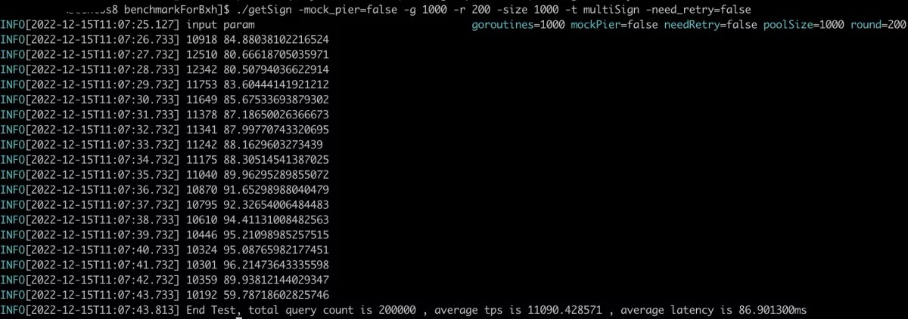

# Get sign benchmark for bitxhub

test bitXHub get sign benchmark.

## Getting started

- you can **clone** the project by

``` shell
git clone git@github.com:Karenlrx/benchmarkForBxh.git
```
- modify config
    you should ensure start bitxhub correctly, and ensure you have store som ibtp data in bitxhub. then modify ip and port, modify getSign interface input of id.
- compile project
``` shell
cd benchmarkForBxh && go build -o getSign main.go 
```

- run test:
``` shell
./getSign -g 1 -r 1 -size 10 -t multiSign -need_retry=false -mock_pier=false
```
    you can get the help of command:
``` shell
Usage of ./getSign:
  -g int
        The number of concurrent go routines to get mutiSign from bitxhub (default 200)
  -mock_pier
        mock pier to get multiSign
  -need_retry
        retry query for mock pier flag
  -r int
        The round of concurrent go routines to get mutiSign from bitxhub (default 100)
  -size int
        The size in grpc client pool (default 200)
  -t string
        The sign type (default "multiSign")
```

## For example
